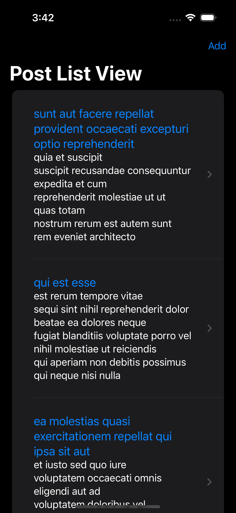
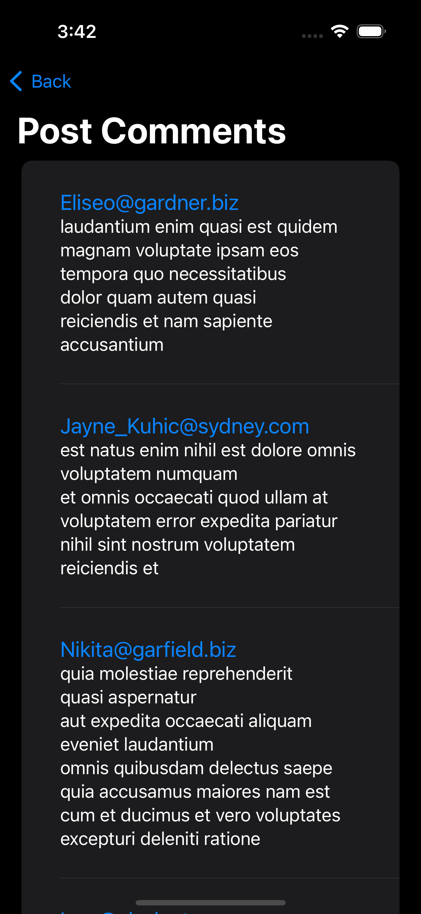
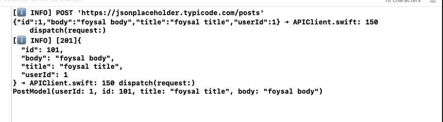

### COMBINE-MVVM-CleanArchitecture-Example
 @ Network Layer:  
 - https://danielbernal.co/writing-a-networking-library-with-combine-codable-and-swift-5/
 - Created by: Daniel Bernal

@ MVVM with Combine:
 - https://github.com/sajjadsarkoobi/CombineNetworking---SwiftUI
 - Created by: Sajjad Sarkoobi

@ Clean Architecture with MVVM & COMBINE Network Call

## Dummy Post & Comment Screen

     
     

----------- Network Log----------

